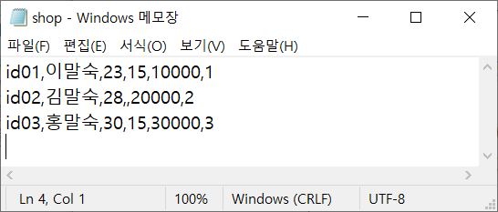
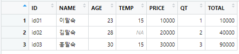
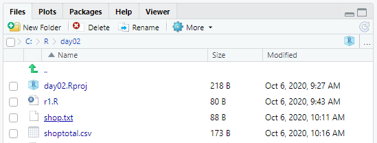

# 데이터 입출력


## 입력 Read

### 01. 엑셀

```R
> library(readxl)
> ex1 <- read_excel("data_ex.xls")
> ex1
# A tibble: 10 x 4
      ID SEX     AGE AREA 
   <dbl> <chr> <dbl> <chr>
 1     1 F        50 서울 
 2     2 M        40 경기 
 3     3 F        28 제주 
 4     4 M        50 서울 
 5     5 M        27 서울 
 6     6 F        23 서울 
 7     7 F        56 경기 
 8     8 F        47 서울 
 9     9 M        20 인천 
10    10 F        38 경기
```


### 02. csv

```R
# exel → csv 파일
> sh <- read.csv("shop.csv", header = T, stringsAsFactors = F, fileEncoding =  "UTF-8")
> sh
  TX_ID  TX_NM TX_A TX_T  TX_P TX_Q
1  id01 이말숙   23   15 10000    1
2  id02 김말숙   28   NA 20000    2
3  id03 홍말숙   30   15 30000    3
```


### 03. 텍스트문서

```R
library(readxl);
# header O
> ex1 <- read.table(file = "mydata.txt", encoding="UTF-8", header = T, sep = ",", stringsAsFactors = F)
> ex1
    id name age
1 id01  lee  10
2 id02  kim  20

# header O, 한글 포함
> ex2 <- read.table(file = "mydata2.txt", fileEncoding ="UTF-8", header = T, sep = ",", stringsAsFactors = F)
> ex2
    id name age
1 id01   이  10
2 id02   김  20

# header X
> ex3 <- read.table("data_exx.TXT", encoding="UTF-8", skip=1);
> colnames(ex2) <- c("ID", "NAME", "AGE")
> ex3
    ID NAME AGE
1 id01  lee  10
2 id02  kim  29
3 id03 hong  30
4 id04   oh  40
```


### 결측치

- 아래와 같이 값이 없을 경우, NA로 입력된다.



```R
> sh <- read.csv("shop.txt", header = F, stringsAsFactors = F, fileEncoding =  "UTF-8")
> colnames(sh) <- c("ID","NAME","AGE","TEMP","PRICE","QT")
> sh
    ID   NAME AGE TEMP PRICE QT
1 id01 이말숙  23   15 10000  1
2 id02 김말숙  28   NA 20000  2
3 id03 홍말숙  30   15 30000  3
```

- 표

  

  


## 출력 Write

### 01. CSV

```R
> write.csv(sh,file = "shoptotal.csv",row.names = T)
```




## 저장 Save

> 임시 저장했다가, 바로 읽어들일때 사용된다.
>
> 확장자 `.rda`로 저장

```R
# 출력
> save(sh,file="shoptotal.rda")

# 입력
> sht <- load("shoptotal.rda")
```

