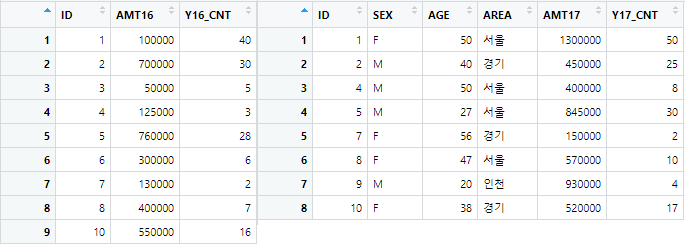
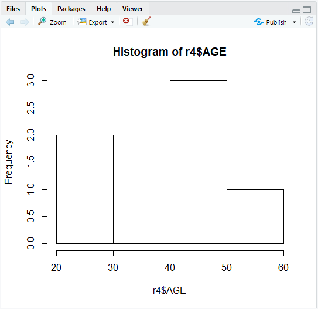
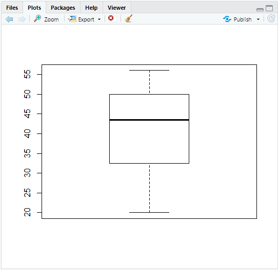

# 데이터 가공

> `dplyr` 패키지 내장


#### 파이프 연산자 Pipe; `%>%`

> 여러번 실행해야하는 복잡한 코드를 한 번에 처리 가능하게 연결


### 01. select()

```R
> sh %>% select(ID)
    ID
1 id01
2 id02
3 id03
4 id01
5 id02
6 id03
7 id01
8 id02
9 id03

> sh %>% select(-ID, -AGE, -GRADE)
    NAME TEMP PRICE QT YYYY MM DD AGE_HL
1 이말숙   15 10000  1 2020  9 30      L
2 김말숙   NA 20000  2 2020  9 30      M
3 홍말숙   15 30000  3 2020  9 30      H
4 이말숙   33 10000  2 2020 10  1      L
5 김말숙   33 20000  1 2020 10  1      M
6 홍말숙   33 30000  1 2020 10  1      H
7 이말숙   25 10000  5 2020  8  1      L
8 김말숙   25 20000  4 2020  8  1      M
9 홍말숙   25 30000  6 2020  8  1      H
```


### 02. filter()

> 조건절을 추출

```R
# 등급이 Gold고, 연령대가 M인 사람들의 총구매액 평균
> sh3 <- sh %>% filter(GRADE == 'G' & AGE_HL == 'M')
> sh3
    ID   NAME AGE TEMP PRICE QT YYYY MM DD AGE_HL GRADE
1 id02 김말숙  28   NA 20000  2 2020  9 30      M     G
2 id02 김말숙  28   25 20000  4 2020  8  1      M     G
> mean(sh3$PRICE * sh3$QT)
[1] 60000
```


### 03. arrange()

> 데이터 정렬

```R
# 나이 오름차순, 날짜 내림차순으로 정렬
> sh4 <- sh %>% arrange(desc(AGE),MM)
> sh4
    ID   NAME AGE TEMP PRICE QT YYYY MM DD AGE_HL GRADE
1 id03 홍말숙  30   25 30000  6 2020  8  1      H     G
2 id03 홍말숙  30   15 30000  3 2020  9 30      H     G
3 id03 홍말숙  30   33 30000  1 2020 10  1      H     S
4 id02 김말숙  28   25 20000  4 2020  8  1      M     G
5 id02 김말숙  28   NA 20000  2 2020  9 30      M     G
6 id02 김말숙  28   33 20000  1 2020 10  1      M     S
7 id01 이말숙  23   25 10000  5 2020  8  1      L     G
8 id01 이말숙  23   15 10000  1 2020  9 30      L     B
9 id01 이말숙  23   33 10000  2 2020 10  1      L     S
```


### 04. summarise()

> 합계

```R
> smr <- sh %>% summarise(TOT = sum(PRICE), AGES = mean(AGE))
> smr
     TOT AGES
1 180000   27
```


### 05. group_by()

> 그룹별

```R
> smr2 <- sh %>% group_by(NAME) %>% summarise(TOTAVG = mean(PRICE * QT))
> smr3 <- as.data.frame(smr2)
> smr3
    NAME    TOTAVG
1 김말숙  46666.67
2 이말숙  26666.67
3 홍말숙 100000.00
```


## 결합 JOIN


### 01. 세로결합

```R

```


### 02. 가로결합

  


- left_join()

  - left_join(data1, data2, by="변수명") : 변수와 data1을 기준으로 data2에 있는 나머지 변수를 결합

  ```R
  > r1 <- left_join(y16, y17, by="ID")
  > r1
    ID  AMT16 Y16_CNT  SEX AGE AREA   AMT17 Y17_CNT
  1  1 100000      40    F  50 서울 1300000      50
  2  2 700000      30    M  40 경기  450000      25
  3  3  50000       5 <NA>  NA <NA>      NA      NA
  4  4 125000       3    M  50 서울  400000       8
  5  5 760000      28    M  27 서울  845000      30
  6  6 300000       6 <NA>  NA <NA>      NA      NA
  7  7 130000       2    F  56 경기  150000       2
  8  8 400000       7    F  47 서울  570000      10
  9 10 550000      16    F  38 경기  520000      17
  
  
  > r2 <- left_join(y17, y16, by="ID")
  > r2
    ID SEX AGE AREA   AMT17 Y17_CNT  AMT16 Y16_CNT
  1  1   F  50 서울 1300000      50 100000      40
  2  2   M  40 경기  450000      25 700000      30
  3  4   M  50 서울  400000       8 125000       3
  4  5   M  27 서울  845000      30 760000      28
  5  7   F  56 경기  150000       2 130000       2
  6  8   F  47 서울  570000      10 400000       7
  7  9   M  20 인천  930000       4     NA      NA
  8 10   F  38 경기  520000      17 550000      16
  ```

- inner_join()

  ```R
  
  ```

- full_join()

  ```R
  
  ```


## 기초 통계 분석 함수

- mean() : 평균
- median() : 중앙값(중위수)
  - 데이터 개수가 짝수면 가운데 있는 두개의 값을 더해 2로 나눈 값
- max() : 최댓값
- min() : 최솟값
- range() : 범위
- quantile() : 분위수
- var() : 분산
- sd() : 표준편차
- kurtosi() : 첨도
- skew() : 왜도


### 기술 통계량; Descriptive Statistic 

1. summary()

   ```R
   > summary(r5)
        AREA              AVG_AMT           AVG_CNT      
    Length:4           Min.   : 175000   Min.   : 4.000  
    Class :character   1st Qu.: 668750   1st Qu.: 5.125  
    Mode  :character   Median : 881667   Median :18.083  
                       Mean   : 765833   Mean   :21.042  
                       3rd Qu.: 978750   3rd Qu.:34.000  
                       Max.   :1125000   Max.   :44.000  
   ```

   

2. describe()

   > `psych` 패키지 내장

   ```R
   > install.packages("psych")
   > library(psych)
   > describe(r4)
           vars  n      mean        sd   median   trimmed       mad    min
   ID         1 10      5.50      3.03      5.5      5.50      3.71      1
   AMT16      2  9 346111.11 270875.64 300000.0 346111.11 296520.00  50000
   Y16_CNT    3  9     15.22     14.04      7.0     15.22      7.41      2
   SEX*       4  8      1.50      0.53      1.5      1.50      0.74      1
   AGE        5  8     41.00     12.36     43.5     41.00      9.64     20
   AREA*      6  8      1.75      0.71      2.0      1.75      0.74      1
   AMT17      7  8 645625.00 361459.71 545000.0 645625.00 329878.50 150000
   Y17_CNT    8  8     18.25     16.18     13.5     18.25     15.57      2
   SUM_AMT    9 10 828000.00 516388.10 950000.0 828125.00 648637.50  50000
   SUM_CNT   10 10     28.30     29.95     14.0     23.62     14.83      4
               max   range  skew kurtosis        se
   ID           10       9  0.00    -1.56      0.96
   AMT16    760000  710000  0.35    -1.71  90291.88
   Y16_CNT      40      38  0.56    -1.49      4.68
   SEX*          2       1  0.00    -2.23      0.19
   AGE          56      36 -0.46    -1.41      4.37
   AREA*         3       2  0.27    -1.30      0.25
   AMT17   1300000 1150000  0.44    -1.12 127795.31
   Y17_CNT      50      48  0.74    -0.88      5.72
   SUM_AMT 1605000 1555000 -0.07    -1.55 163296.25
   SUM_CNT      90      86  0.82    -0.87      9.47
   ```

   

### 빈도 분석; Freq

> 데이터의 항목별 빈도 및 빈도 비율
>
> `descr` 패키지 내장

```R
> install.packages("descr")
> library(descr)
# ploat = F : 막대그래프 제외
> fq <- freq(r5$AREA,plot = F)
> fq
r5$AREA 
      Frequency Percent
NONE          1      25
경기          1      25
서울          1      25
인천          1      25
Total         4     100
```


## 그래프

### 히스토그램

> 도수 분포 상태를 기둥으로 표현

```R
> hist(r4$AGE)
```

 


### 상자그림 (Boxplot)

> 데이터의 분포를 비교
>
> 데이터 분포에서 심하게 벗어난 극단의 데이터-이상치-를 판단

```R
> boxplot(r4$AGE)
```

 