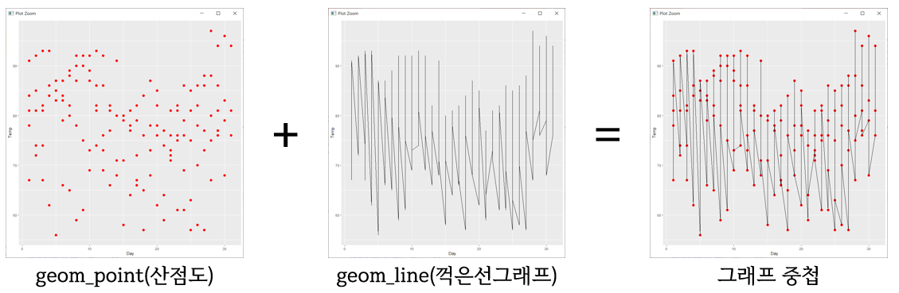
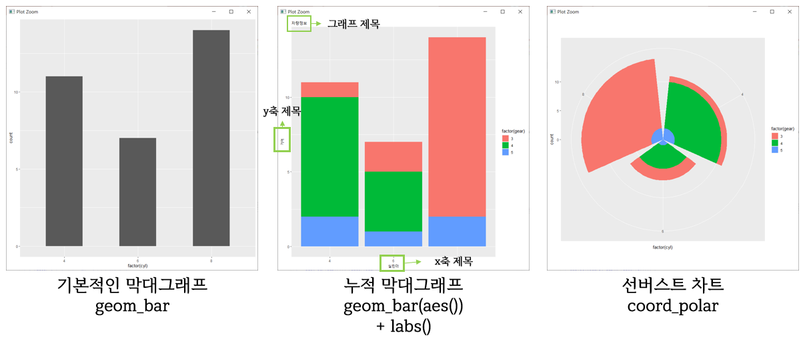

# 패키지

### 주요 패키지

- 데이터베이스 처리 : RMySQL, RPostgresSQL, RSQLite
- 엑셀 처리 : XLConnect, readxl
- 데이터 조작 : dplyr
- 데이터 레이아웃 변환 : reshape2
- 문자열 처리 : stringr


#### 데이터 준비

```R
# airquality : R에서 기본적으로 준비된 데이터
> head(airquality)
  Ozone Solar.R Wind Temp Month Day
1    41     190  7.4   67     5   1
2    36     118  8.0   72     5   2
3    12     149 12.6   74     5   3
4    18     313 11.5   62     5   4
5    NA      NA 14.3   56     5   5
6    28      NA 14.9   66     5   6
> dim(airquality)
[1] 153   6
> str(airquality)
'data.frame':	153 obs. of  6 variables:
 $ Ozone  : int  41 36 12 18 NA 28 23 19 8 NA ...
 $ Solar.R: int  190 118 149 313 NA NA 299 99 19 194 ...
 $ Wind   : num  7.4 8 12.6 11.5 14.3 14.9 8.6 13.8 20.1 8.6 ...
 $ Temp   : int  67 72 74 62 56 66 65 59 61 69 ...
 $ Month  : int  5 5 5 5 5 5 5 5 5 5 ...
 $ Day    : int  1 2 3 4 5 6 7 8 9 10 ...
> head(airquality)
```


## reshape2

>  레이아웃 변환 패키지

### melt()

> column명 → row data 전환
>
> melt(data, id.vars = "기준 열", measure.vars = "변환 열")

```R
> library(reshape2)
> names(airquality) <- toupper(names(airquality))
> m_air <- melt(airquality, id.vars = c("MONTH","DAY"), measure.vars = c("OZONE"))
> m_air
    MONTH DAY variable value
1       5   1    OZONE    41
2       5   2    OZONE    36
3       5   3    OZONE    12
4       5   4    OZONE    18
5       5   5    OZONE    NA
6       5   6    OZONE    28
...
150     9  27    OZONE    NA
151     9  28    OZONE    14
152     9  29    OZONE    18
153     9  30    OZONE    20
> mean_temp <- mean(m_air$value, na.rm = T)
> mean_temp
[1] 42.12931
```


### cast()

> row data → column명 전환

- dcast()

  > 데이터 프레임(Data Frame) 형태를 변환
  >
  > dcast(data, 기준 열 ~ 변환 열(row→column))

  ```R
  > library(reshape2)
  
  # 세로로 긴 데이터 준비
  > names(airquality) <- toupper(names(airquality))
  > m_air <- melt(airquality, id.vars = c("MONTH","DAY"), na.rm = T)
  > # m_air$value <- ifelse(is.na(m_air$value), 0, m_air$value)
  > dim(m_air)
  [1] 568   4
  > names(m_air) <- toupper(names(m_air))
  > m_air
      MONTH DAY VARIABLE VALUE
  1       5   1    OZONE  41.0
  2       5   2    OZONE  36.0
  3       5   3    OZONE  12.0
  ...
  294     9  18  SOLAR.R  27.0
   [ getOption("max.print") 에 도달했습니다 -- 318 행들을 생략합니다 ]
  
  # 가로 정렬
  # 기준 열 : MONTH, DAY
  # 변환 열 : VARIABLE
  > n_air <- dcast(m_air, MONTH + DAY ~ VARIABLE)
  Using VALUE as value column: use value.var to override.
  > n_air
      MONTH DAY OZONE SOLAR.R WIND TEMP
  1       5   1    41     190  7.4   67
  2       5   2    36     118  8.0   72
  3       5   3    12     149 12.6   74
  4       5   4    18     313 11.5   62
  ...
  150     9  27    NA     145 13.2   77
  151     9  28    14     191 14.3   75
  152     9  29    18     131  8.0   76
  153     9  30    20     223 11.5   68
  ```

- acast()

  > 벡터(Vector), 행렬(Matrix), 배열(Array) 형태를 변환
  >
  > acast(data, 기준 열 ~ 변환 열(row→column) ~ 분리 기준 열)

  ```R
  > library(reshape2)
  > names(airquality) <- toupper(names(airquality))
  > m_air <- melt(airquality, id.vars = c("MONTH","DAY"), na.rm = T)
  > names(m_air) <- toupper(names(m_air))
  
  > a_air <- acast(m_air, DAY ~ MONTH ~ VARIABLE)
  Using VALUE as value column: use value.var to override.
  > a_air
  , , OZONE
  
       5  6   7   8  9
  1   41 NA 135  39 96
  2   36 NA  49   9 78
  ...
  31  37 NA  59  85 NA
  
  , , SOLAR.R
  
       5   6   7   8   9
  1  190 286 269  83 167
  2  118 287 248  24 197
  ..
  31 279  NA 254 188  NA
  
  , , WIND
  
        5    6    7    8    9
  1   7.4  8.6  4.1  6.9  6.9
  2   8.0  9.7  9.2 13.8  5.1
  ..
  31  7.4   NA  9.2  6.3   NA
  
  , , TEMP
  
      5  6  7  8  9
  1  67 78 84 81 91
  2  72 74 85 81 92
  ...
  31 76 NA 81 94 NA
  # 5 ~ 9월(column)까지, 1 ~ 31일(row)까지의 오존, 태양 복사, 바람, 온도 측정값 출력
  ```

- cast() 함수의 요약

  > d/acast(data, 기준 열 ~ 변환 열(row→column), 요약값)
  >
  > 합(sum), 평균(mean), 카운트(length) 등으로 요약 가능

  ```R
  # dcast
  > n_air <- dcast(m_air, MONTH ~ VARIABLE, mean)
  Using VALUE as value column: use value.var to override.
  > n_air
    MONTH    OZONE  SOLAR.R      WIND     TEMP
  1     5 23.61538 181.2963 11.622581 65.54839
  2     6 29.44444 190.1667 10.266667 79.10000
  3     7 59.11538 216.4839  8.941935 83.90323
  4     8 59.96154 171.8571  8.793548 83.96774
  5     9 31.44828 167.4333 10.180000 76.90000
  
  # acast
  > a_air <- acast(m_air, MONTH ~ VARIABLE, mean)
  Using VALUE as value column: use value.var to override.
  > a_air
       OZONE  SOLAR.R      WIND     TEMP
  5 23.61538 181.2963 11.622581 65.54839
  6 29.44444 190.1667 10.266667 79.10000
  7 59.11538 216.4839  8.941935 83.90323
  8 59.96154 171.8571  8.793548 83.96774
  9 31.44828 167.4333 10.180000 76.90000
  ```

  - ex.

    ```R
    > # 학생 별 과목 별 성적 평균을 구하시오
    > score <- read.table(file = "test.txt", fileEncoding = "UTF-8", header = T, sep = ",", stringsAsFactors = F)
    > score
         NAME KO EN MA  SI
    1  이말숙 90 86 91 100
    2  정말숙 91 85 92  98
    3  장말숙 92 84 93  88
    4  이말숙 93 83 94  90
    5  정말숙 94 82 95  70
    6  장말숙 95 81 96  80
    7  이말숙 90 86 91 100
    8  정말숙 91 85 92  98
    9  장말숙 92 84 93  88
    10 이말숙 93 83 94  90
    11 정말숙 94 82 95  70
    12 장말숙 95 81 96  80
    
    # NAME을 기준으로 각각의 column을 row 값으로 변환
    > m_score <- melt(score, id.vars = "NAME", na.rm = T)
    > names(m_score) <- toupper (names(m_score))
    > m_score
         NAME VARIABLE VALUE
    1  이말숙       KO    90
    2  정말숙       KO    91
    3  장말숙       KO    92
    ...
    46 이말숙       SI    90
    47 정말숙       SI    70
    48 장말숙       SI    80
    
    #  NAME을 기준으로 같은 과목값(VARIABLE)을 요약
    > d_score <- dcast(m_score, NAME ~ VARIABLE, mean)
    Using VALUE as value column: use value.var to override.
    > d_score
        NAME   KO   EN   MA SI
    1 이말숙 91.5 84.5 92.5 95
    2 장말숙 93.5 82.5 94.5 84
    3 정말숙 92.5 83.5 93.5 84
    ```


## KoNLP

> KoNLO; Korean Natural Language Process
>
> 한국어 분석 패키지

```R
# Rtools35.exe 설치 후,
install.packages("multilinguer")

# 의존성 설치
install.packages(c("hash", "tau", "Sejong", "RSQLite", "devtools", "bit", "rex", "lazyeval", "htmlwidgets", "crosstalk", "promises", "later", "sessioninfo", "xopen", "bit64", "blob", "DBI", "memoise", "plogr", "covr", "DT", "rcmdcheck", "rversions"), type = "binary")

# Git을 통해 KoNLP 설치
install.packages("remotes")
remotes::install_github('haven-jeon/KoNLP', upgrade = "never", INSTALL_opts=c("--no-multiarch"))

# wordcloud 설치
install.packages("wordcloud2")

# 설치 확인 및 단어 다운로드
library(KoNLP)	#KoNLP 패키지 로드
useSystemDic()	# 시스템 사전 설정
useSejongDic()	# 세종 사전 설정
useNIADic()		# NIADic 사전 설정
```


### 형태소 분석

사용 문서 : [KBS NEWS](http://news.kbs.co.kr/news/view.do?ncd=5020936)

1. 텍스트 데이터 가져오기

   ```R
   # 1. 텍스트 데이터 가져오기
   wd <- readLines("wc.txt", encoding = "UTF-8")
   # 2. url로 데이터 가져오기
   wd <- readLines("http://news.kbs.co.kr/news/view.do?ncd=5020936", encoding = "UTF-8")
   ```

2. 명사 추출

   - sapply(data, 적용 함수)

     ```R
     wd <- sapply(wd, extractNoun, USE.NAMES = F)
     ```

3. 등록되지 않은 명사는 사용자 정의 사전에 추가

   - buildDictionary(user_dic = data.frame(`data`)) : 사용자 정의 사전 추가

   - rep() : 동일한 과정을 반복

     - ncn : KAIST 품사 태그 기준으로 비서술성명사로 설정
     - replace_usr_dic = T : 기존 사전의 내용과 상관없이 대체

     ```R
     add_wd <- c("코로나","코로나19")
     buildDictionary(user_dic = data.frame(add_wd, rep("ncn",length(add_wd))), replace_usr_dic = T)
     629899 words dictionary was built.
     
     # 명사 재추출
     wd2 <- sapply(wd, extractNoun, USE.NAMES = F)
     ```

     

4. 행렬을 벡터로 변환

   ```R
   lwd <- unlist(wd2)
   ```

5. 특정 단어 삭제

   - gsub(찾는 단어, 바꿀 단어, 찾을 위치)

     - `[텍스트]` : 대괄호 안에 묶인 글자중 하나라도 매칭되는 것
     - `(텍스트)` : 소괄호 안에 묶인 글자 모두가 매칭되는 것
     - `\\괄호` : 괄호 앞의 역슬래쉬는 문자 그대로 괄호를 갖게 함
     -  `.+` : 하나 이상의 모든 글자
       - `+` : 하나 이상
       - `.` : 모든 글자

     ```R
     lwd <- gsub("\\[.+\\]", "", lwd)
     lwd <- gsub("\\(이모티콘\\)", "", lwd)
     lwd <- gsub("[0-9]", "", lwd)
     lwd <- gsub("[a-z]", "", lwd)
     lwd <- gsub("[A-Z]", "", lwd)
     lwd <- gsub("[~!@#$%^&*()_+=?]<>", "", lwd)
     ```

6. 필터링

   ```R
   lwd2 <- Filter(function(x){
     nchar(x) >= 2
   }, lwd)
   ```

7. 사용 빈도 확인

   - table(data) : 통계 분석 함수

     ```R
     wc <- table(lwd2)
     ```

8. 데이터 정렬

   - sort(data)

     - 기본값은 오름차순, 내림차순 정렬시 `decreasing = T` 옵션 추가

     ```R
     > wc <- sort(wc, decreasing = T)
     > wc
     lwd2
             방역         기간         반장         추석           11         거리 
                6            5            4            4            3            3 
             논의         이후       조정안         중앙         특별         감염 
                3            3            3            3            3            2 
             다양         단계         발표         본부     사고수습         연휴 
                2            2            2            2            2            2 
             예정       일요일         정부         필요       가운데         감소 
                2            2            2            2            1            1 
             결정         경우         관련         관찰         구체         국내 
                1            1            1            1            1            1 
             기획         내용         노출         다음         대책         들이 
                1            1            1            1            1            1 
             등락         반복         발생         방안         부분         부처 
                1            1            1            1            1            1 
             분포       브리핑         사회         상황         생활         세종 
                1            1            1            1            1            1 
             수칙         시간         신규         안들         양상         언급 
                1            1            1            1            1            1 
             영향         오늘       온라인         요청       위원회         윤태 
                1            1            1            1            1            1 
             의사         이번       이번주       잠정적         적용         전략 
                1            1            1            1            1            1 
             증감 지방자치단체   지켜달라고         직접         집단         차원 
                1            1            1            1            1            1 
             청사         총괄       최종적         추세         추이     코로나19 
                1            1            1            1            1            1 
             해서         형태         확산       확진자         환자 
                1            1            1            1            1 
     ```


## wordcloud

> wordcloud와 wordcloud2 패키지가 존재

### 01. wordcloud

```R
# 패키지 로드
library(wordcloud)
library(tm)
library(RCurl)
library(RColorBrewer)

# 저장할 이미지 요소 설정
jpeg(filename = "p.jpg", width = 300, height = 300, quality = 120)

# wordcloud 생성
palate <- brewer.pal(9,"Set1")
wordcloud(names(wc), freq = wc, scale = c(5,0,5), rot.per = 0.35, min.freq=1, random.order = F, random.color = T, colors = palate)
# 파일시스템으로 추출
dev.off()
```


### 02. wordcloud2

- minSize : 시각화할 최소 빈도수 설정
- size : 배수 기준 워드클라우드 변경
- col : 색상 설정
- rotateRatio : 회전율
- backgroundColor : 배경색
- figPath : 이미지

```R
library(wordcloud2)

# 저장할 이미지 요소 설정
# jpeg 설정은 이미지 생성 전에 선언
jpeg(filename = "p.jpg", width = 300, height = 300, quality = 120)

# wordcloud2 생성
wordcloud2(wc, color = "random-light", backgroundColor = "black")
dev.off()
```


#### 출력 이미지


## ex. 카카오톡 대화로 워드클라우드 만들기

- 대화 내보내기를 통해 `.txt` 문서 준비

  ```R
  # 패키지 로드
  library(KoNLP)
  library(wordcloud2)
  library(wordcloud)
  library(tm)
  library(RCurl)
  library(RColorBrewer)
  useSystemDic()
  useSejongDic()
  useNIADic()
  
  # 데이터 읽기
  wd <- readLines("kakao.txt", encoding = "UTF-8")
  wd2 <- sapply(wd, extractNoun, USE.NAMES = F)
  lwd <- unlist(wd2)
  
  # 날짜, 이름 지우기
  lwd <- gsub("\\[.+\\]", "", lwd)
  lwd <- gsub("\\-.+\\-", "", lwd)
  lwd <- gsub("오전", "", lwd)
  lwd <- gsub("오후", "", lwd)
  
  # 숫자, 대소문자, 자음/모음 의성어 지우기
  lwd <- gsub("[0-9]", "", lwd)	# 0부터 9까지
  lwd <- gsub("[a-z]", "", lwd)	# a부터 z까지
  lwd <- gsub("[A-Z]", "", lwd)	# A부터 Z까지
  lwd <- gsub("[ㄱ-ㅎ]", "", lwd)	# ㄱ부터 ㅎ까지
  lwd <- gsub("(ㅜ|ㅠ)+", "", lwd)	#ㅜ 또는 ㅠ
  
  # 이모티콘 지우기
  lwd <- gsub("\\(이모티콘\\)", "", lwd)
  
  # 특수문자 지우기
  lwd <- gsub("[~!@#$%^&*()_+=?]<>", "", lwd)
  lwd <- gsub("\\^.+\\^", "", lwd)
  
  # 두 글자 이상의 단어만 추출
  lwd2 <- Filter(function(x){
    nchar(x) >= 2
  }, lwd)
  
  wc <- table(lwd2)
  wc <- sort(wc, decreasing = T, 300)
  
  # wordcloud2 → view로 생성
  wordcloud2(wc, color = "random-light", backgroundColor = "black")
  
  # wordcloud → plots로 생성
  palate <- brewer.pal(9,"Set1")
  wordcloud(names(wc), freq = wc, scale = c(5,0,5), rot.per = 0.35, min.freq=1, random.order = F, random.color = T, colors = palate)
  jpeg(filename = "p.jpg", width = 300, height = 300, quality = 120)
  dev.off()
  #savePlot(filename = "wc", type = "png")
  ```

  


## dplyr

> 데이터 조작 패키지

### filter()

> 조건식에 맞는 데이터를 필터링 : 행 추출

```R
> library(dplyr)
> score <- read.table(file = "test.txt", fileEncoding = "UTF-8", header = T, sep = ",", stringsAsFactors = F)
# 조건 중첩시 & 사용
> filter(score, KO >= 90 & EN >= 85)
    NAME KO EN MA  SI
1 이말숙 90 86 91 100
2 정말숙 91 85 92  98
3 이말숙 90 86 91 100
4 정말숙 91 85 92  98
```


### select()

> 지정한 변수 선택 : 열 추출

```R
# 지정 변수는 , 로 선택
> select(score, NAME, KO, EN)
     NAME KO EN
1  이말숙 90 86
2  정말숙 91 85
3  장말숙 92 84
4  이말숙 93 83
5  정말숙 94 82
6  장말숙 95 81
7  이말숙 90 86
8  정말숙 91 85
9  장말숙 92 84
10 이말숙 93 83
11 정말숙 94 82
12 장말숙 95 81
```


### arrange()

> 오름차순/내림차순으로 정렬

```R
> library(dplyr)
> score <- read.table(file = "test.txt", fileEncoding = "UTF-8", header = T, sep = ",", stringsAsFactors = F)
# 기본 설정은 오름차순, 내림차순으로 정렬시 desc(column) 설정
> arrange(score, NAME, desc(KO))
     NAME KO EN MA  SI
1  이말숙 93 83 94  90
2  이말숙 93 83 94  90
3  이말숙 90 86 91 100
4  이말숙 90 86 91 100
5  장말숙 95 81 96  80
6  장말숙 95 81 96  80
7  장말숙 92 84 93  88
8  장말숙 92 84 93  88
9  정말숙 94 82 95  70
10 정말숙 94 82 95  70
11 정말숙 91 85 92  98
12 정말숙 91 85 92  98
```


## ggplot2

> 시각화 패키지

```R
> install.packages("ggplot2")
> library(ggplot2)

> str(airquality)
'data.frame':	153 obs. of  6 variables:
 $ Ozone  : int  41 36 12 18 NA 28 23 19 8 NA ...
 $ Solar.R: int  190 118 149 313 NA NA 299 99 19 194 ...
 $ Wind   : num  7.4 8 12.6 11.5 14.3 14.9 8.6 13.8 20.1 8.6 ...
 $ Temp   : int  67 72 74 62 56 66 65 59 61 69 ...
 $ Month  : int  5 5 5 5 5 5 5 5 5 5 ...
 $ Day    : int  1 2 3 4 5 6 7 8 9 10 ...

# 기본적인 그래프 생성
# ggplot(data, aes(데이터 속성))
> ggplot(airquality, aes(x = Day, y = Temp))
```


### geom_point()

> 산점도 : 두 변수의 관계를 파악하기 위해 평면에 관측점을 찍어서 표현
>
> geom_point(옵션)

```R
library(ggplot2)
ggplot(airquality, aes(x = Day, y = Temp)) +
  geom_point(size = 3,color = "red")
```


### geom_line()

> 꺽은선그래프

```R
ggplot(airquality, aes(x = Day, y = Temp)) +
  geom_line()
```




### geom_bar

> 막대그래프

```R
# factor : 현재 가지고 있는 데이터의 범주 출력
ggplot(mtcars, aes(x=factor(cyl))) + 
  geom_bar(aes(fill=factor(gear))) +			# geom_bar(aes(누적할 열)): 누적 막대그래프
  coord_polar() + 								# 선버스트 차트
  labs(x="실린더", y="기어", title="차량정보")	  # 그래프 및 축 제목
```




## googleVis

> 구글 서비스를  활용하는 시각화 패키지