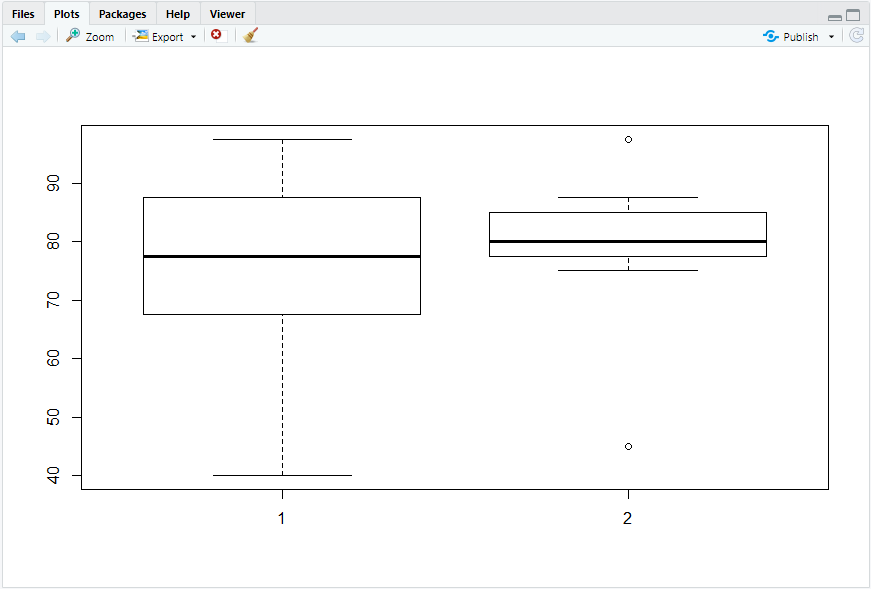

# Workshop


## 10/05

- ws01

  ```R
  > library(readxl)
  # 엑셀에 학번, 이름, 국어, 영어, 수학 -> 학생 정보 기입
  # data.frame으로 엑셀 가져오기
  > grade <- read_excel("C:/R/day01/ws01.xlsx")
  > is.data.frame(grade)
  [1] TRUE
  
  # 각 학생의 성적 합과 평균 추가
  > grade$합산 <- rowSums(grade[,c("국어","영어","수학")])
  > grade$평균 <- rowMeans(grade[,c("국어","영어","수학")])
  > grade
  # A tibble: 10 x 7
     학번  이름    국어  영어  수학  합산  평균
     <chr> <chr>  <dbl> <dbl> <dbl> <dbl> <dbl>
   1 id01  이새롬    80    88    72   240  80  
   2 id02  박혜성    90    97    91   278  92.7
   3 id03  오성현   100    87    81   268  89.3
   4 id04  정성훈    95    72    82   249  83  
   5 id05  전민찬    85    97    76   258  86  
   6 id06  이나영    70    78    86   234  78  
   7 id07  김재현    75    79    88   242  80.7
   8 id08  최인정    60    97    76   233  77.7
   9 id09  하종수    65    97    89   251  83.7
  10 id10  채희진    80    49   100   229  76.3
  ```

  

- ws02

  ```R
  # data.go.kr 또는 서울시에서 데이터를 다운받아 R에서 data.frame으로 읽어 들이시오
  # csv 파일
  > library(readxl)
  > accident <- read.csv("C:/R/day01/도로교통공단_고속도로 교통사고(2019).csv", encoding = "ANSI", header = T, sep = ",", stringsAsFactors = F)
  > accident
      시도       시군구 사고건수 사망자수 중상자수 경상자수 부상신고자수
  1   서울         중구        1        0        2        0            0
  2   서울       강남구        2        0        2        1            1
  3   서울       강동구       33        0       11       48           17
  4   서울       송파구       23        0        1       28            6
  5   서울       서초구       42        0       22       89           60
  6   서울       양천구        3        1        1        5            0
  7   서울       중랑구        4        1        1        1            2
  8   서울       노원구        7        1        1       11            1
  9   서울       금천구        5        0        1       11            0
  10  부산     해운대구        2        0        0        3            0
  11  부산       사하구        1        0        1        0            0
  12  부산       금정구       23        0        6       40            3
  13  부산       강서구       44        1       18       64            5
  14  부산       사상구        4        0        0        5            0
  15  부산       기장군       15        0        7       27            0
  16  경기       수원시       63        2       26       67           16
  17  경기       성남시      170        3       69      269           74
  18  경기     의정부시       27        0        6       41           10
  19  경기       안양시       65        1       14       84           15
  20  경기       부천시       56        1       16       78            2
  21  경기       안산시       73        3       12      109           11
  22  경기       평택시      116        8       47      191           42
  23  경기       광명시       27        0        7       46            2
  24  경기       구리시       93        0       16       99           42
  25  경기       양주시       17        0        7       18            2
  26  경기       여주시       44        2       31       81           25
  27  경기       화성시      172        4       58      283           43
  28  경기       시흥시       96        7       23      128           10
  29  경기       파주시        1        0        0        1            0
  30  경기       고양시       30        0       10       28            7
  31  경기       광주시       29        2        9       51           21
  32  경기       포천시        7        0        5        7            4
  33  경기       가평군       12        0       14       29            0
  34  경기       양평군       18        0        8       26            4
  35  경기       이천시       58       11       36       87           14
  36  경기       용인시      241        5      100      453          167
  37  경기       안성시       89        2       28      140           41
  38  경기       김포시       32        1        8       36            6
  39  경기       과천시        1        0        0        2            1
  40  경기       군포시       38        0       19       45           14
  41  경기     남양주시       75        3       24       90           36
  42  경기       오산시       69        1       14      127           23
  43  경기       의왕시       46        4       19       64           24
  44  경기       하남시      115        3       35      140           37
  45  강원       춘천시       26        2        9       84            2
  46  강원       원주시       33        1       10       66            1
  47  강원       동해시        6        1        2        8            0
  48  강원       강릉시       19        2        8       37            5
  49  강원       속초시        3        0        4        4            0
  50  강원       삼척시        1        0        4        0            0
  51  강원       홍천군       22        3        6       32            9
  52  강원       횡성군       19        1        3       39            2
  53  강원       평창군       16        0        4       32            1
  54  강원       인제군        4        0        3        5            0
  55  강원       양양군       11        0        3       28            5
  56  충북       청주시       96        6       41      160           16
  57  충북       충주시       54        2       36      128            9
  58  충북       제천시        8        0       12       24            0
  59  충북       보은군       20        2       16       45            3
  60  충북       옥천군        5        1        4        5            0
  61  충북       영동군       11        2       10        9            0
  62  충북       진천군       36        1       24       89            8
  63  충북       괴산군       16        0        5       32            5
  64  충북       음성군       30        3       20       41            2
  65  충북       단양군        6        2        4       19           10
  66  충북       증평군        2        0        0        6            0
  67  충남       천안시      115        4       33      217            7
  68  충남       보령시       13        5        9       13            4
  69  충남       공주시       60        7       28      123            7
  70  충남       서산시       11        2        3       17            2
  71  충남       금산군        4        0        1       12            0
  72  충남       논산시       20        0       11       27            3
  73  충남       부여군        2        1        3        1            0
  74  충남       서천군        5        0        3        3            0
  75  충남       청양군        2        0        1        2            0
  76  충남       홍성군        6        0        3       12            0
  77  충남       예산군        4        0        1        4            0
  78  충남       당진시       40        4       26       77            0
  79  전북       전주시       10        1        6       15            1
  80  전북       군산시        7        0        7       24            3
  81  전북       정읍시       12        1        3       26            0
  82  전북       남원시        6        2        3       16            0
  83  전북       김제시       15        2       14       28            5
  84  전북       완주군       14        0        8       29            1
  85  전북       진안군        1        0        1        1            0
  86  전북       무주군        3        0        3       11            0
  87  전북       장수군        2        0        1        1            0
  88  전북       임실군        8        0        3       17            3
  89  전북       순창군        3        0        1        4            0
  90  전북       고창군        6        2        1        6            0
  91  전북       부안군        8        0        1       17            0
  92  전북       익산시       13        0        6       23            2
  93  전남       순천시       30        3       15       39            0
  94  전남       나주시        6        0        2       14            0
  95  전남       광양시       11        1        6        8            0
  96  전남       담양군       14        1       11       21            0
  97  전남       곡성군       15        1        3       21            0
  98  전남       구례군        2        0        3        2            0
  99  전남       보성군        6        0        6       11            0
  100 전남       장흥군        2        0        1        5            0
  101 전남       강진군        1        0        0        1            0
  102 전남       영암군        1        0        0        2            0
  103 전남       무안군       17        0        3       29            0
  104 전남       함평군       10        1        5       12            3
  105 전남       장성군       20        0        9       43            0
  106 경북       포항시        4        1        4        5            0
  107 경북       경주시       21        1       14       30            2
  108 경북       김천시       20        3        9       26            0
  109 경북       안동시        6        0        1       15            2
  110 경북       구미시       23        0       15       42            0
  111 경북       영주시        3        1        2        9            0
  112 경북       영천시       36        4       18       47            2
  113 경북       문경시       24        1        8       50            2
  114 경북       상주시       22        5       13       32            0
  115 경북       군위군       21        8       32       39            1
  116 경북       의성군        5        0        2        6            0
  117 경북       청송군        3        0        3        2            0
  118 경북       영덕군        1        0        0        0            1
  119 경북       청도군        9        1        6        7            1
  120 경북       고령군        6        0        2       10            0
  121 경북       성주군        4        0        1        7            0
  122 경북       칠곡군       44        0       31       61            0
  123 경북       예천군        2        0        2        3            0
  124 경북       경산시       15        1        5       15            0
  125 경남       진주시       18        2       12       20            2
  126 경남       통영시        2        0        3        1            0
  127 경남       김해시      126        3       40      214            8
  128 경남       밀양시       13        1       11       15            1
  129 경남       함안군       48        3       30       74           11
  130 경남       창녕군       10        1        9       11            0
  131 경남       양산시       64        3       29      103            5
  132 경남       고성군        3        0        3        3            0
  133 경남       사천시        6        0        4       14            1
  134 경남       하동군        8        1        4       16            0
  135 경남       산청군        3        0        3        3            2
  136 경남       함양군       13        2       13       18            0
  137 경남       거창군        2        0        1        2            0
  138 경남       합천군        5        1        2       11            0
  139 경남 창원시(통합)       34        1       25       89           14
  140 대구         동구       41        3       25       75            0
  141 대구         서구       24        0        5       41            2
  142 대구         북구       43        5       20       63            1
   [ getOption("max.print") 에 도달했습니다 -- 21 행들을 생략합니다 ]
  ```

  

## 10/06

1. 16,17년 결재 금액의 합과 견수의 합을 테이블에 추가하시오. SUM_AMT, SUM_CNT

   ```R
   # Q1
   > r4 <- full_join(y16, y17, by="ID")
   > r4
      ID  AMT16 Y16_CNT  SEX AGE AREA   AMT17 Y17_CNT
   1   1 100000      40    F  50 서울 1300000      50
   2   2 700000      30    M  40 경기  450000      25
   3   3  50000       5 <NA>  NA <NA>      NA      NA
   4   4 125000       3    M  50 서울  400000       8
   5   5 760000      28    M  27 서울  845000      30
   6   6 300000       6 <NA>  NA <NA>      NA      NA
   7   7 130000       2    F  56 경기  150000       2
   8   8 400000       7    F  47 서울  570000      10
   9  10 550000      16    F  38 경기  520000      17
   10  9     NA      NA    M  20 인천  930000       4
   
   > r4$SUM_AMT <- rowSums(r4 %>% select(AMT16, AMT17), na.rm = T)
   > r4$SUM_CNT <- rowSums(r4 %>% select(Y16_CNT, Y17_CNT), na.rm = T)
   > r4
      ID  AMT16 Y16_CNT  SEX AGE AREA   AMT17 Y17_CNT SUM_AMT SUM_CNT
   1   1 100000      40    F  50 서울 1300000      50 1400000      90
   2   2 700000      30    M  40 경기  450000      25 1150000      55
   3   3  50000       5 <NA>  NA <NA>      NA      NA   50000       5
   4   4 125000       3    M  50 서울  400000       8  525000      11
   5   5 760000      28    M  27 서울  845000      30 1605000      58
   6   6 300000       6 <NA>  NA <NA>      NA      NA  300000       6
   7   7 130000       2    F  56 경기  150000       2  280000       4
   8   8 400000       7    F  47 서울  570000      10  970000      17
   9  10 550000      16    F  38 경기  520000      17 1070000      33
   10  9     NA      NA    M  20 인천  930000       4  930000       4
   ```

   

2. 지역 별 사용금액 평균과 사용 횟수의 평균을 구하시오

   ```R
   > r5 <- r4 %>% group_by(AREA) %>% summarise(AVG_AMT = mean(SUM_AMT),
   +                                     		AVG_CNT = mean(SUM_CNT))
   > r5 <- as.data.frame(r5)
   > r5$AREA <- ifelse(is.na(r5$AREA),'NONE',r5$AREA)
   > r5 <- r5 %>% arrange(desc(AVG_AMT))
   > r5
     AREA   AVG_AMT  AVG_CNT
   1 서울 1125000.0 44.00000
   2 인천  930000.0  4.00000
   3 경기  833333.3 30.66667
   4 NONE  175000.0  5.50000
   ```

   
   
3. 연습문제 (150-151p)

   |       | mid_exam |      |      | final_exam |      |      |
   | ----- | -------- | ---- | ---- | ---------- | ---- | ---- |
   | CLASS | ID       | MATH | ENG  | ID         | MATH | ENG  |
   | 1     | 1        | 30   | 40   | 1          | 50   | 50   |
   | 1     | 2        | 100  | 95   | 2          | 95   | 100  |
   | 1     | 3        | 95   | 90   | 3          | 80   | 85   |
   | 1     | 4        | 70   | 80   | 4          | 80   | 80   |
   | 1     | 5        | 80   | 90   | 5          | 90   | 80   |
   | 1     | 6        | 85   | 90   | 6          | 70   | 80   |
   | 1     | 7        | 50   | 70   | 7          | 60   | 80   |
   | 1     | 8        | 0    | 30   | 9          | 75   | 75   |
   | 1     | 9        | 60   | 80   | 10         | 90   | 75   |
   | 1     | 10       | 85   | 85   |            |      |      |

   ```R
   > library(readxl)
   > library(dplyr)
   > library(descr)
   
   # 01.
   > mid_exam <- as.data.frame(read_excel("mid_exam.xlsx"))
   > mid_exam <- rename(mid_exam, MATH_MID=MATH, ENG_MID=ENG)
   > mid_exam
      CLASS ID MATH_MID ENG_MID
   1      1  1       30      40
   2      1  2      100      95
   3      1  3       95      90
   4      1  4       70      80
   5      1  5       80      90
   6      1  6       85      90
   7      1  7       50      70
   8      1  8        0      30
   9      1  9       60      80
   10     1 10       85      85
   
   # 02.
   > final_exam <- as.data.frame(read_excel("final_exam.xlsx"))
   > final_exam <- rename(final_exam, MATH_FINAL=MATH, ENG_FINAL=ENG)
   > final_exam
     ID MATH_FINAL ENG_FINAL
   1  1         50        50
   2  2         95       100
   3  3         80        85
   4  4         80        80
   5  5         90        80
   6  6         70        80
   7  7         60        80
   8  9         75        75
   9 10         90        75
   
   # 03.
   > total_exam <- inner_join(mid_exam, final_exam, by="ID")
   > total_exam
     CLASS ID MATH_MID ENG_MID MATH_FINAL ENG_FINAL
   1     1  1       30      40         50        50
   2     1  2      100      95         95       100
   3     1  3       95      90         80        85
   4     1  4       70      80         80        80
   5     1  5       80      90         90        80
   6     1  6       85      90         70        80
   7     1  7       50      70         60        80
   8     1  9       60      80         75        75
   9     1 10       85      85         90        75
   
   # 04.
   > total_exam$MATH_AVG <- rowMeans(total_exam %>% select(MATH_MID, MATH_FINAL))
   > total_exam$ENG_AVG <- rowMeans(total_exam %>% select(ENG_MID, ENG_FINAL))
   > total_exam
     CLASS ID MATH_MID ENG_MID MATH_FINAL ENG_FINAL MATH_AVG ENG_AVG
   1     1  1       30      40         50        50     40.0    45.0
   2     1  2      100      95         95       100     97.5    97.5
   3     1  3       95      90         80        85     87.5    87.5
   4     1  4       70      80         80        80     75.0    80.0
   5     1  5       80      90         90        80     85.0    85.0
   6     1  6       85      90         70        80     77.5    85.0
   7     1  7       50      70         60        80     55.0    75.0
   8     1  9       60      80         75        75     67.5    77.5
   9     1 10       85      85         90        75     87.5    80.0
   
   # 05.
   > total_exam$TOTAL_AVG <- rowMeans(total_exam %>% select(MATH_MID, MATH_FINAL, ENG_MID, ENG_FINAL))
   > total_exam
     CLASS ID MATH_MID ENG_MID MATH_FINAL ENG_FINAL MATH_AVG ENG_AVG TOTAL_AVG
   1     1  1       30      40         50        50     40.0    45.0     42.50
   2     1  2      100      95         95       100     97.5    97.5     97.50
   3     1  3       95      90         80        85     87.5    87.5     87.50
   4     1  4       70      80         80        80     75.0    80.0     77.50
   5     1  5       80      90         90        80     85.0    85.0     85.00
   6     1  6       85      90         70        80     77.5    85.0     81.25
   7     1  7       50      70         60        80     55.0    75.0     65.00
   8     1  9       60      80         75        75     67.5    77.5     72.50
   9     1 10       85      85         90        75     87.5    80.0     83.75
   
   # 06.
   > total_exam %>% summarise(TOTAL_MATH_AVG = mean(MATH_AVG),
   +                          T0TAL_ENG_AVG = mean(ENG_AVG))
     TOTAL_MATH_AVG T0TAL_ENG_AVG
   1       74.72222      79.16667
   
   # 07.
   > total_exam %>% filter(MATH_MID >= 80 & ENG_MID >= 90)
     CLASS ID MATH_MID ENG_MID MATH_FINAL ENG_FINAL MATH_AVG ENG_AVG TOTAL_AVG
   1     1  2      100      95         95       100     97.5    97.5     97.50
   2     1  3       95      90         80        85     87.5    87.5     87.50
   3     1  5       80      90         90        80     85.0    85.0     85.00
   4     1  6       85      90         70        80     77.5    85.0     81.25
   
   # 08.
   > boxplot(total_exam$MATH_AVG, total_exam$ENG_AVG)
   ```

   


