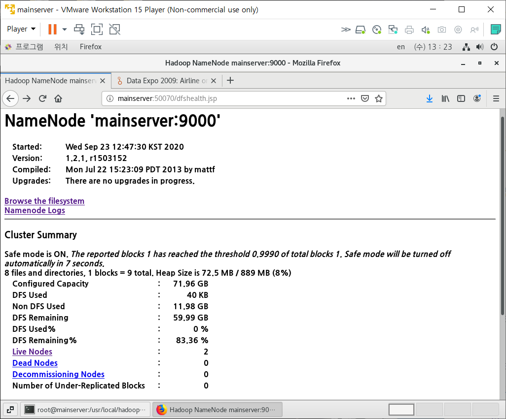
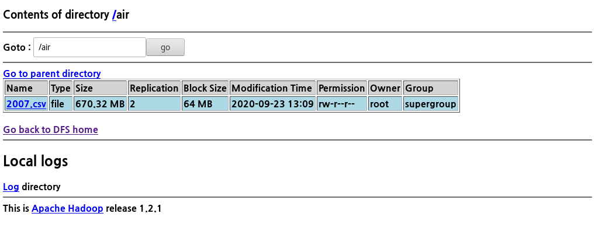
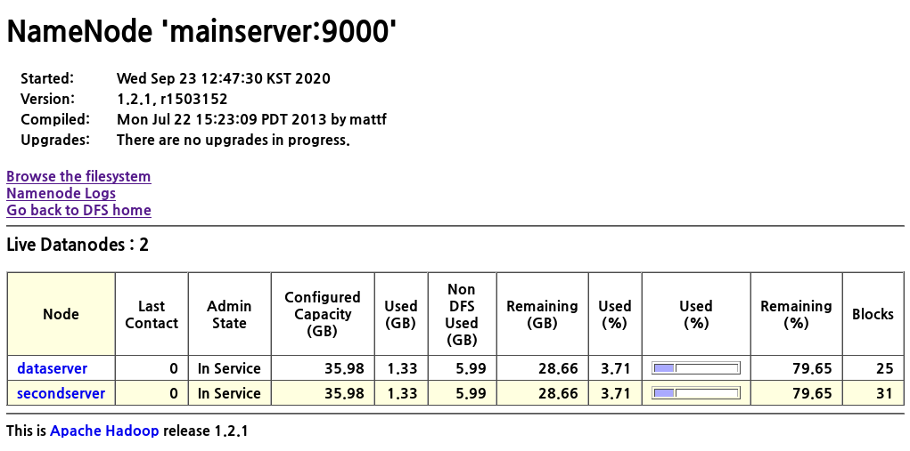
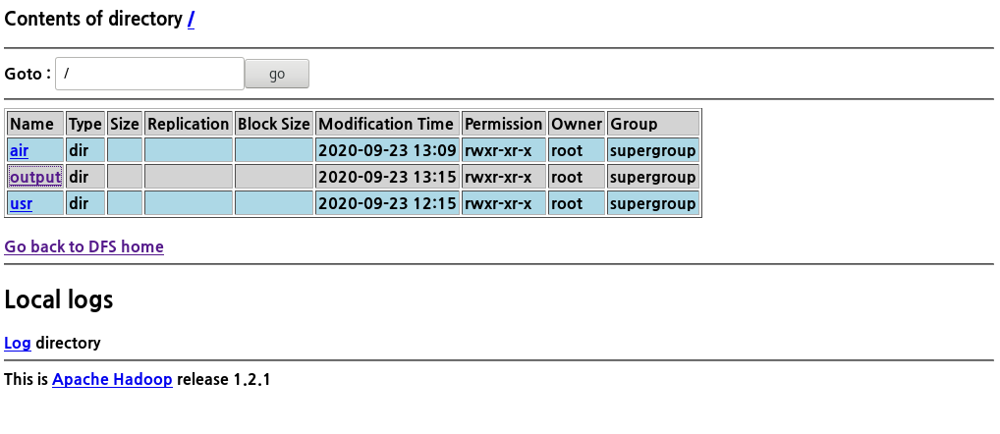
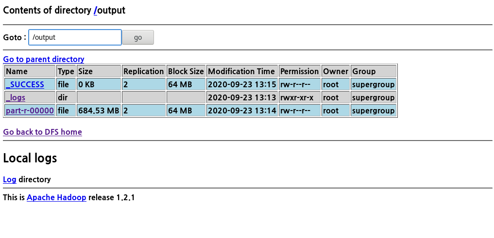

## 완전 분산 모드 Hadoop

- Namenode
  - JobTraker : 클러스터 노드에서 실행되는 사용자 애플리케이션을 관리한다. 사용자가 코드를 하둡클러스터에 넘기고 나면, JobTracker는 여러가지 실행 계획을 결정하게 된다.
  - test 환경 설정값: ip = 192.168.111.120 / hostname = mainserver
- Secondary Namenode
  - test 환경 설정값: ip = 192.168.111.121 / hostname = secondserver
- DataNode
  - TaskTraker; 각 노드에 할당된 작업의 실행을 담당한다.
  - test 환경 설정값: ip = 192.168.111.122 / hostname = dataserver
  - test 환경으로 secondserver도 DataNode로 사용


## 완전 분산 모드 Hadoop 설치

1. server hostname, ip 설정

2. mainserver에 jdk 설치

3. SSH 설정

   ```bash
   # mainserver
   
   ls .ssh
   id_dsa  id_dsa.pub
   
   # ssh-copy-id -i [복사할 공개키 경로] [대상 서버 계정]@[대상 서버]
   # 모든 서버에 아래와 같이 공개키 복사
   ssh-copy-id -i /root/.ssh/id_dsa.pub root@mainserver
   /bin/ssh-copy-id: INFO: Source of key(s) to be installed: "/root/.ssh/id_dsa.pub"
   The authenticity of host 'mainserver (192.168.111.120)' can't be established.
   ECDSA key fingerprint is SHA256:O9yV8HvVlFqpgYIEikwuRCqshkBR5vFFzaDKJtp5FVY.
   ECDSA key fingerprint is MD5:15:2b:cb:38:c5:f1:2d:16:59:df:70:73:34:e0:2f:b7.
   Are you sure you want to continue connecting (yes/no)? yes
   /bin/ssh-copy-id: INFO: attempting to log in with the new key(s), to filter out any that are already installed
   /bin/ssh-copy-id: INFO: 1 key(s) remain to be installed -- if you are prompted now it is to install the new keys
   root@mainserver's password: 
   
   Number of key(s) added: 1
   
   Now try logging into the machine, with:   "ssh 'root@mainserver'"
   and check to make sure that only the key(s) you wanted were added.
   
   ls .ssh
   authorized_keys  id_dsa  id_dsa.pub  known_hosts
   ```

   ```bash
   # mainserver에서 password 입력 없이 다른 서버로 로그인 가능
   ssh dataserver
   Last login: Wed Sep 23 10:01:36 2020
   
   exit
   logout
   Connection to dataserver closed.
   ```

   ```bash
   # secondserver / dataserver
   ls .ssh
   authorized_keys
   ```

   

4. mainserver 외 서버에 jdk 복사; 파일 복사

   ```bash
   # scp [복사할 파일/폴더 경로] [대상 서버 계정]@[대상 서버]:[복사될 경로]
   # dataserver도 똑같이 실행
   scp /etc/hosts root@secondserver:/etc/hosts
   scp ./jdk-8u261-linux-x64.tar.gz root@secondserver:/root
   scp /usr/bin/java root@secondserver:/usr/bin/java
   ```

   

5. mainserver 외 서버에 jdk 설치; 원격 조종

   ```bash
   # ssh [대상 서버 계정]@[대상 서버] [명령어]
   # dataserver도 똑같이 실행
   ssh root@secondserver tar xvf /root/jdk*
   ssh root@secondserver mv jdk1.8.0_261 jdk1.8.0
   ssh root@secondserver cp -r /root/jdk1.8.0 /usr/local
   ```

   

6. 하둡 설치

   ```bash
   # mainserver 하둡 설치
   wget https://archive.apache.org/dist/hadoop/common/hadoop-1.2.1/hadoop-1.2.1.tar.gz
   tar xvf hadoop-1.2.1.tar.gz 
   cp -r hadoop-1.2.1 /usr/local
   
   #HADOOP_HOME 지정
   vi /etc/profile
   
        52 JAVA_HOME=/usr/local/jdk1.8.0
        53 CLASSPATH=/usr/local/jdk1.8.0/lib
        54 HADOOP_HOME=/usr/local/hadoop-1.2.1
        55 export JAVA_HOME CLASSPATH HADOOP_HOME
        56 PATH=$JAVA_HOME/bin:$HADOOP_HOME/bin:.:$PATH
   
   # mainserver 외 서버에 HADOOP_HOME 복사
   scp /etc/profile root@secondserver:/etc/profile
   ```

   

7. hadoop 환경설정; mainserver

   ```bash
   vi hadoop-env.sh
   
        9 export JAVA_HOME=/usr/local/jdk1.8.0
        10 export HADOOP_HOME_WARN_SUPPRESS="TRUE"
   ```

   ```bash
   vi core-site.xml
   
   <configuration>
   	<property>
   		<name>fs.default.name</name>
   		<value>hdfs://mainserver:9000</value>
   	</property>
   	<property>
   		<name>hadoop.tmp.dir</name>
   		<value>/usr/local/hadoop-1.2.1/tmp</value>
   	</property>
   </configuration>
   ```

   ```bash
   vi hdfs-site.xml
   
   <configuration>
   	<property>
   		<name>dfs.replication</name>
   		<value>2</value> 
   	</property>
   	<property>
   		<name>dfs.webhdfs.enabled</name>
   		<value>true</value>
   	</property>
   	<property>
   		<name>dfs.name.dir</name>
   		<value>/usr/local/hadoop-1.2.1/name</value>
   	</property>
   	<property>
   		<name>dfs.data.dir</name>
   		<value>/usr/local/hadoop-1.2.1/data</value>
   	</property>
   </configuration>
   ```

   ```bash
   vi mapred-site.xml
   
   <configuration>
   	<property>
   		<name>mapred.job.tracker</name>
   		<value>mainserver:9001</value>
   	</property>
   </configuration>
   ```

   ```bash
   # 보조네임노드(Secondary Namenode)를 실행할 서버를 설정
   vi masters
   
   secondserver
   ```

   ```bash
   # 데이터노드(Datanode)를 실행할 서버를 설정
   vi slaves
   
   secondserver
   dataserver
   ```

   

8. 하둡 환경설정 파일 복사

   ```bash
   cd /usr/local
   tar cvfz hadoop.tar.gz ./hadoop-1.2.1
   
   # dataserver도 똑같이 실행
   scp hadoop.tar.gz root@secondserver:/usr/local
   ssh root@secondserver tar xvf /usr/local/hadoop.tar.gz
   ssh root@secondserver mv /root/hadoop-1.2.1 /usr/local
   ```

9. 하둡 실행

   ```bash
   # 초기화
   hadoop namenode -format
   # 하둡과 관련된 모든 데몬 실행
   start-all.sh
   
   # 하둡 데몬 실행 여부 확인
   cd /usr/local/jdk1.8.0/bin
   
   # mainserver
   jps
   5796 JobTracker
   5613 NameNode
   6429 Jps
   
   # secondserver
   jps
   4899 SecondaryNameNode
   4998 TaskTracker
   4812 DataNode
   5197 Jps
   
   # dataserver
   jps
   58482 Jps
   58243 TaskTracker
   58139 DataNode
   ```

10. 하둡 웹브라우저

    


## Test

1. 데이터 다운로드

   https://dataverse.harvard.edu/dataset.xhtml?persistentId=doi:10.7910/DVN/HG7NV7

   ```bash
   ls
   2007.csv.bz2
   
   bzip2 -d 2007.csv.bz2
   ```

2. 하둡에 데이터 저장

   ```bash
   hadoop fs -mkdir /air
   hadoop fs -put 2007.csv /air
   ```

   - 하둡 웹브라우저에서 확인시

   

   

   

3. 예제 실행

   ```bash
   cd /usr/local/hadoop-1.2.1/
   # -jar 파일에 있는 wordcount 클래스를 실행
   # 입력값은 air, 출력값은 output
   hadoop jar hadoop-examples-1.2.1.jar wordcount /air /output
   ```

   - 하둡 웹브라우저에서 확인

   

   

