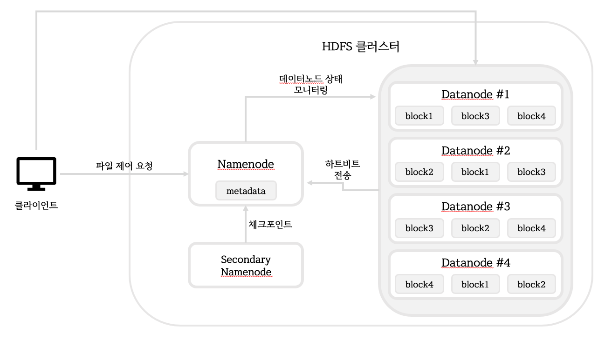
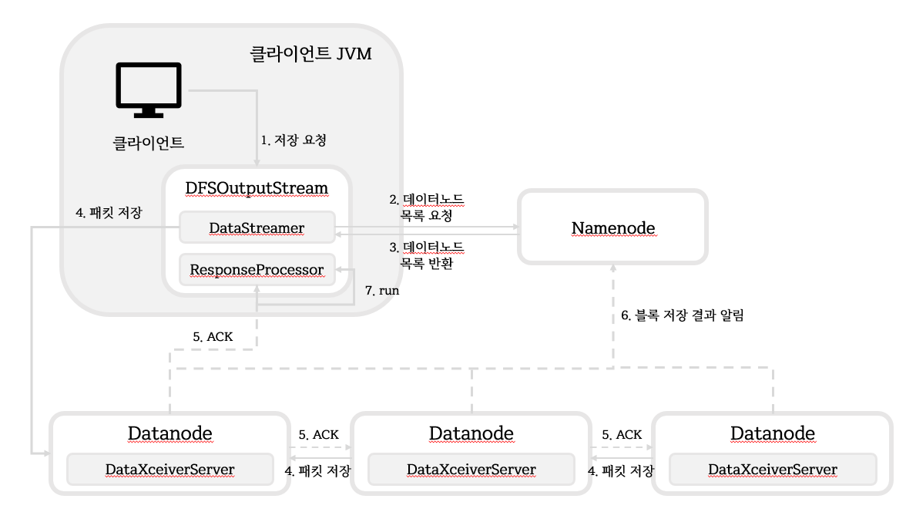

# HDFS

> Hadoop Distributed File System
>
> 대용량 파일을 분산된 서버에 저장하고, 많은 클라이언트가 저장된 데이터를 빠르게 처리할 수 있게 설계된 파일 시스템

- 장애 복구
- 스트리밍 방식의 데이터 접근

- 대용량 데이터 저장 : 64MB 형태로 데이터 저장
- 데이터 무결성 : 삭제, 이동, 복사는 가능하나 수정은 불가
  - 하둡 2.0 알파 버전부터 append가 가능


### HDFS 아키텍처



(70p 참고)


### 기존의 대용량 파일 시스템

- DAS; Direct-Attached Storage
- NAS; Network-Attached Storage
- SAN; Storage Area Network

기존의 대용량 파일 시스템은 하드 디스크를 연결하여 데이터 적재만 가능했으나, HDFS는 컴퓨터 안에 데이터를 저장, 처리할 수 있는 모듈을 만들 수 있다.


#### 네임노드

- 메타데이터 관리
- 데이터노드 모니터링
- 블록 관리
- 클라이언트 요청 접수


#### 보조 네임노드

- 메타데이터 변경시 보조 네임노드도 업데이트 -> 단순히 메타데이터의 백업
- 네임노드의 오류로 새로운 네임노드 설치시
  1. 보조 네임노드에 백업된 메모리 파일 `fsimage.ckpt`을 네임노드로 전송
  2. 네임노드는 `fsimage`를 보조네임노드가 전송한 `fsimage.ckpt`로 변경


### 패킷 전송



(73p 참고)


## HDFS 명령어

- 파일 목록 보기

  - ls : 지정한 디렉터리/파일의 정보를 출력

    ```bash
    # hadoop fs -ls [디렉터리 | 파일]
    hadoop fs -ls /usr
    
    Found 1 items
    drwxr-xr-x   - root supergroup          0 2020-09-23 14:11 /usr/local
    ```

  - lsr : 지정한 디렉터리의 하위 디렉터리 정보까지 출력

    ```bash
    # hadoop fs -lsr [디렉터리 | 파일]
    hadoop fs -lsr /
    
    drwxr-xr-x   - root supergroup          0 2020-09-23 14:11 /usr
    drwxr-xr-x   - root supergroup          0 2020-09-23 14:11 /usr/local
    drwxr-xr-x   - root supergroup          0 2020-09-23 14:11 /usr/local/hadoop-1.2.1
    drwxr-xr-x   - root supergroup          0 2020-09-23 14:11 /usr/local/hadoop-1.2.1/tmp
    drwxr-xr-x   - root supergroup          0 2020-09-23 14:11 /usr/local/hadoop-1.2.1/tmp/mapred
    drwx------   - root supergroup          0 2020-09-23 14:11 /usr/local/hadoop-1.2.1/tmp/mapred/system
    -rw-------   1 root supergroup          4 2020-09-23 14:11 /usr/local/hadoop-1.2.1/tmp/mapred/system/jobtracker.info
    ```

    

- 파일 용량 확인

  - du : 지정한 디렉터리/파일의 사용량을 확인

    ```bash
    # hadoop fs -du [디렉터리/파일]
    hadoop fs -du /
    
    Found 1 items
    2001        hdfs://mainserver:9000/usr
    ```

  - dus : 전체 합계 용량만 출력

    ```bash
    # hadoop fs -dus [디렉터리/파일]
    hadoop fs -dus /
    
    hdfs://mainserver:9000/	2001
    ```

    

- 파일 내용 보기

  - cat : 지정한 파일의 내용을 출력 (텍스트 파일만)

    ```bash
    # hadoop fs -cat [파일]
    hadoop fs -cat /usr/ana*
    
    #version=DEVEL
    # System authorization information
    auth --enableshadow --passalgo=sha512
    # Use CDROM installation media
    cdrom
    # Use graphical install
    graphical
    # Run the Setup Agent on first boot
    firstboot --enable
    ignoredisk --only-use=sda
    # Keyboard layouts
    keyboard --vckeymap=kr --xlayouts='kr'
    # System language
    lang ko_KR.UTF-8
    
    # Network information
    network  --bootproto=dhcp --device=ens33 --ipv6=auto --activate
    network  --hostname=localhost.localdomain
    
    ...
    ```

  - text : zip 파일 형태로 압축된 파일도 텍스트 형태로 출력

    ```bash
    hadoop fs -text [파일]
    ```

    

- 디렉토리 생성 : mkdir

  ```bash
  hadoop fs -mkdir [디렉터리]
  ```

  

- 파일 복사

  - put : 지정한 로컬 파일 시스템의 파일/디렉터리를 목적지 경로로 복사

  - copyFromLocal

    ```bash
    # hadoop fs -put [로컬 디렉터리/파일] [목적지 디렉터리/파일]
    ```

  - get : HDFS에 저장된 데이터를 로컬 파일 시스템으로 복사

    ```bash
    # 복사할 파일 준비
    hadoop fs -put README.txt /test
    hadoop jar hadoop-examples-1.2.1.jar wordcount /test /output
    # 복사
    # hadoop fs -get [소스 디렉터리/파일] [로컬 디렉터리/파일]
    hadoop fs -get /output/part-r-00000 result.txt
    ```

  - getmerge : 지정한 경로에 있는 모든 파일의 내용을 합친 후, 로컬 파일 시스템에 하나의 파일로 복사

    ```bash
    # hadoop fs -getmerge [소스 디렉터리/파일] [로컬 파일명]
    hadoop fs -getmerge /output resultall.txt
    ```

    

- 디렉터리 삭제: rmr

  ```bash
  # hadoop fs -rmr [디렉터리]
  hadoop fs -rmr /output
  ```

  

