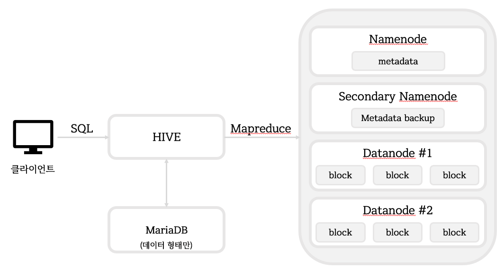

# 하이브

> 하둡에 저장된 데이터를 쉽게 처리할 수 있는 데이터웨어하우스 패키지
>
> SQL 요청을 자동으로 맵리듀스 형태로 출력


## HIVE Architecture




## 하이브 설치

1. MariaDB 설치

   - client, common, server download
     - https://downloads.mariadb.com/MariaDB/mariadb-10.0.15/yum/centos7-amd64/rpms/
     - test 환경상 pwd는 111111으로 통일

   ```bash
   yum -y remove mariadb-libs
   yum -y localinstall Maria*
   
   systemctl restart mysql
   systemctl status mysql
   
   chkconfig mysql on
   
   # root pwd 설정
   mysqladmin -u root password '111111'
   # MariaDB root로 로그인
   mysql -h localhost  -u  root  -p
   use mysql;
   # user, host 확인
   SELECT  user, host  FROM  user;
   # 사용자 생성 : hive, pwd=111111
   GRANT   ALL   ON   *.*  TO   hive@'mainserver'  IDENTIFIED  BY  '111111';
   # hive_db database 생성
   CREATE   DATABASE   hive_db   CHARACTER   SET   utf8;
   
   use   hive_db
   ```

   

2. HIVE 다운로드

   - wget https://archive.apache.org/dist/hive/hive-1.0.1/apache-hive-1.0.1-bin.tar.gz

   ```bash
   tar xvf apache-hive-1.0.1-bin.tar.gz
   ```

   

