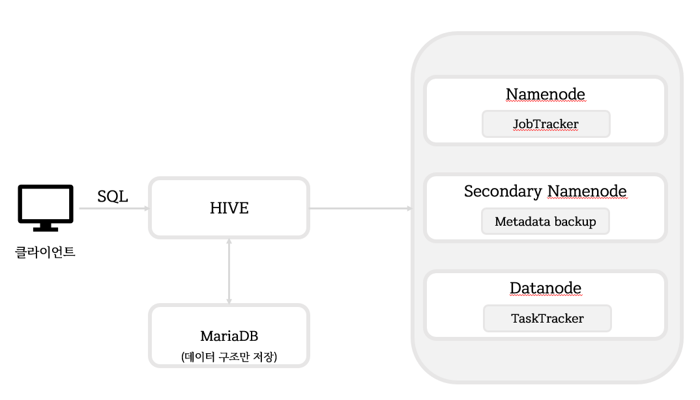

# 하이브

> 하둡에 저장된 데이터를 쉽게 처리할 수 있는 데이터웨어하우스 패키지
>
> SQL 요청을 자동으로 맵리듀스 형태로 출력


## HIVE Architecture




## 집계 함수

| 함수     | 내용                 |
| -------- | -------------------- |
| COUNT( ) | 데이터 건수를 반환   |
| SUM( )   | 칼럼값의 합계를 반환 |
| AVG( )   | 칼럼값의 평균을 반환 |
| MAX( )   | 칼럼의 최댓값을 반환 |
| MIN( )   | 칼럼의 최솟값을 반환 |


## 내장 함수

| 함수                                                         | 내용                                                         |
| ------------------------------------------------------------ | ------------------------------------------------------------ |
| concat(string a, string b, ....)                             | 문자열 a 뒤에 문자열 b를 붙여 반환                           |
| substr(string str, int start)                                | 문자열 start 인덱스에서 마지막 인덱스까지 반환               |
| substr(string str, int start, int length)                    | 문자열 start 인덱스에서 length만큼을 잘라 반환               |
| upper(string str) \| ucase(string str)                       | 문자열을 대문자로 변환                                       |
| lower(string str) \| lcase(string str)                       | 문자열을 소문자로 변환                                       |
| trim(string str) \| ltrim(string str) \| rtrim(string str)   | [양쪽 \| 왼쪽 \| 오른쪽]에 있는문자열 공백을 제거            |
| regexp_replace(string str, string regex, string replacement) | 문자열에서 regex와 일치하는 문자열을 replacement로 변경해 반환 |
| from_unixtime(int unixtime)                                  | 유닉스 시간 문자열(1970-01-01 00:00:00 UTC)를 현재 시스템의 시간대로 반환 |
| to_date(string timestamp)                                    | 문자열에서 날짜값만 반환                                     |
| year(string date)                                            | 문자열에서 연도만 반환                                       |
| month(string date)                                           | 문자열에서 월만 반환                                         |
| day(string date)                                             | 문자열에서 일만 반환                                         |
| round(double a)                                              | a의 반올림 정수값을 반환                                     |
| floor(double a)                                              | a의 최대 정수값을 반환 (버림)                                |
| ceil(double a)                                               | a의 최소 정수값을 반환 (올림)                                |
| rand() \| rand(int seed)                                     | 랜덤값 반환. seed 파라미터로 랜덤값 범위 설정 가능           |
| get_json_object(string json_string, string parh)             | 디렉터리 path에서 문자열 json_string으로부터 json 객체를 추출하고 json 문자열로 반환. 유효하지 않다면 null 값 반환 |
| size(Map<K. V>) \| size(Array<T>)                            | [맵 \| 배열] 타입의 엘리먼트의 개수를 반환                   |
| cast(<expr> as <type>)                                       | expr을 type으로 타입을 변환                                  |


## 조인

> 하이브는 EQ 조인만 지원한다.


## 파티션 테이블

- LOAD DATA 명령어 : 로컬 / HDFS 파일을 로딩
- INSERT INTO TABLE 구문 : 기존 데이터를 덮어쓰지 않고 데이터를 입력
- INSERT OVERWRITE TABLE 구문 : 데이터를 입력할 때 기존 데이터를 덮어씀


## 데이터 정렬

- ORDER BY : 전체 정렬, But 속도가 느림
- SORT BY : 각 리듀서의 출력 결과를 정렬


## 하이브 설치

1. MariaDB 설치

   - client, common, server download
     - https://downloads.mariadb.com/MariaDB/mariadb-10.0.15/yum/centos7-amd64/rpms/
     - test 환경상 pwd는 111111으로 통일

   ```bash
   yum -y remove mariadb-libs
   yum -y localinstall Maria*
   
   systemctl restart mysql
   systemctl status mysql
   
   chkconfig mysql on
   
   # root pwd 설정
   mysqladmin -u root password '111111'
   # MariaDB root로 로그인
   mysql -h localhost  -u  root  -p
   use mysql;
   # user, host 확인
   SELECT  user, host  FROM  user;
   # 사용자 생성 : hive, pwd=111111
   GRANT   ALL   ON   *.*  TO   hive@'127.0.0.1'  IDENTIFIED  BY  '111111';
   
   # hive_db database 생성
   mysql -h localhost  -u  hive  -p
   CREATE   DATABASE   hive_db;
   
   use   hive_db
   ```

   

2. HIVE 다운로드

   - wget https://archive.apache.org/dist/hive/hive-1.0.1/apache-hive-1.0.1-bin.tar.gz

   ```bash
   tar xvf apache-hive-1.0.1-bin.tar.gz
   mv apache-hive-1.0.1-bin hive
cp -r hive /usr/local
   ```
   
   
   
3. HIVE_HOME 설정

   ```bash
   vi /etc/profile
   
        52 JAVA_HOME=/usr/local/jdk1.8.0
        53 CLASSPATH=/usr/local/jdk1.8.0/lib
        54 HADOOP_HOME=/usr/local/hadoop-1.2.1
        55 HIVE_HOME=/usr/local/hive
        56 
        57 export JAVA_HOME CLASSPATH HADOOP_HOME HIVE_HOME
        58 PATH=$JAVA_HOME/bin:$HADOOP_HOME/bin:$HIVE_HOME/bin:.:$PATH
   ```

   

4. MySQL을 메타스토어 데이터베이스로 사용

   - mariadb jdbc driver를 하이브의 lib 디렉터리에 복사

   ```bash
   cp mariadb-java-client-1.3.5.jar /usr/local/hive/lib
   ```

   - hive-site.xml 

   ```bash
   cd /usr/local/hive/conf
   vi hive-site.xml
   
   <?xml version="1.0"?>
   <?xml-stylesheet type="text/xsl" href="configuration.xsl"?>
   
   <configuration>
       <property>
           <name>hive.metastore.local</name>
           <value>false</value>
           <description>controls whether to connect to remove metastore server or open a new metastore server in Hive Client JVM</description>
       </property>
       
       <property>
           <name>javax.jdo.option.ConnectionURL</name>
           <value>jdbc:mariadb://localhost:3306/hive_db?createDatabaseIfNotExist=true</value>
           <description>JDBC connect string for a JDBC metastore</description>
       </property>
   
       <property>
           <name>javax.jdo.option.ConnectionDriverName</name>
           <value>org.mariadb.jdbc.Driver</value>
           <description>Driver class name for a JDBC metastore</description>
       </property>
       # 계정명
       <property>
           <name>javax.jdo.option.ConnectionUserName</name>
           <value>hive</value>
           <description>username to use against metastore database</description>
       </property>
       # pwd
       <property>
           <name>javax.jdo.option.ConnectionPassword</name>
           <value>111111</value>
           <description>password to use against metastore database</description>
       </property>
   
   </configuration>
   ```

   

5. HIVE DIRECTORY SETTING

   ```bash
   hadoop fs -mkdir /tmp
   hadoop fs -mkdir /user/root/warehouse
   hadoop fs -chmod 777 /tmp
   hadoop fs -chmod 777 /user/root/warehouse
   hadoop fs -mkdir /tmp/hive
   hadoop fs -chmod 777 /tmp/hive
   ```

6. HIVE 실행

   ```bash
   hive
   ```

   

## Test

1. 데이터 테이블 작성 및 파일 업로드

   ```sql
   /* 테이블 생성 */
   hive> CREATE TABLE HDI(id INT, country STRING, hdi FLOAT, lifeex INT, mysch INT, eysch INT, gni INT) ROW FORMAT DELIMITED FIELDS TERMINATED BY ',' STORED AS TEXTFILE;
   
   /* 파일 업로드 */
   hive> load data local inpath '/root/hdi.txt' into table HDI;
   
   /* 업로드된 파일 확인 */
   hive> select * from hdi limit 5;
   OK
   NULL		NULL	NULL	NULL	NULL	NULL
   1	Norway	0.943	81	12	17	47557
   2	Australia	0.929	81	12	18	34431
   3	Netherlands	0.91	80	11	16	36402
   4	United States	0.91	78	12	16	43017
   Time taken: 0.369 seconds, Fetched: 5 row(s)
   ```

2. 데이터 입력

   - 예제 데이터 : ASA에서 2009년에 공개한 미국 항공편 운항 통계 데이터
   - 링크 : `https://dataverse.harvard.edu/dataset.xhtml?persistentId=doi:10.7910/DVN/HG7NV7`

   - Air Data Structure

     ```sql
     CREATE TABLE airline_delay(
     Year INT,
     MONTH INT,
     DayofMonth INT,
     DayofWeek INT,
     DepTime INT,
     CRSDepTime INT,
     ArrTime INT,
     CRSArrTime INT,
     UniqueCarrier STRING,
     FlightNum INT,
     TailNum STRING,
     ActualElapsedTime INT,
     CRSElapsedTime INT,
     AirTime INT,
     ArrDelay INT,
     DepDelay INT,
     Origin STRING,
     Dest STRING,
     Distance INT,
     TaxiIn INT,
     TaxiOut INT,
     Cancelled INT,
     CancellationCode STRING
     COMMENT 'A = carrier, B = weather, C = NAS, D = security',
     Diverted INT COMMENT '1 = yes, 0 = no',
     CarrierDelay STRING,
     WeatherDelay STRING,
     NASDelay STRING,
     SecurityDelay STRING,
     LateAircraftDelay STRING)
     COMMENT 'TEST DATA'
     PARTITIONED BY (delayYear INT)
     ROW FORMAT DELIMITED
     FIELDS TERMINATED BY ','
     LINES TERMINATED BY '\n'
     STORED AS TEXTFILE;
     ```

   - 데이터 업로드

     ```sql
     /* OVERWRITE INTO : 중복된 데이터가 있어도 무시하고 입력 */
     /* PARTITION : 파티션키 설정 */
     hive> LOAD DATA LOCAL INPATH '/root/2006.csv' OVERWRITE INTO TABLE airline_delay PARTITION (delayYear='2006');
         
     hive> LOAD DATA LOCAL INPATH '/root/2007.csv' OVERWRITE INTO TABLE airline_delay PARTITION (delayYear='2007');
     
     hive> LOAD DATA LOCAL INPATH '/root/2008.csv' OVERWRITE INTO TABLE airline_delay PARTITION (delayYear='2008');
     ```

     ```sql
     SELECT year, month, deptime, arrtime flightnum FROM airline_delay
     WHERE delayYear='2006'
     LIMIT 10;
     ```

   - ex) 년도 별 출발 지연 시간, 도착 지연 시간의 평균

     ```sql
     SELECT Year, AVG(ArrDelay), AVG(DepDelay) FROM airline_delay
     GROUP BY year;
     ```

   - ex) 2008년 월 별 출발 도착 지연 시간의 평균

     ```sql
     SELECT Year, Month, AVG(arrdelay), AVG(depdelay)  FROM airline_delay                          
     WHERE delayYear = 2008
     GROUP BY Year, Month
     ORDER BY Year, Month;
     ```

     

3. Java Application 연동

   - hive 서버 실행

   ```bash
   hive --service hiveserver2
   ```

   - 필요 라이브러리(Java Project)
     1. commons-logging-X.jar
     2. hive-exec-X.jar
     3. hive-jdbc-X.jar
     4. hive-jdbc-X-standalone.jar
     5. hive-metastore-X.jar
     6. hive-service-X.jar
     7. libfb303-X.jar
     8. log4j-X.jar

4. Java Program

   ```java
   import java.sql.Connection;
   import java.sql.DriverManager;
   import java.sql.PreparedStatement;
   import java.sql.ResultSet;
   
   public class HiveTest {
   
   	public static void main(String[] args) throws Exception {
   		String url ="jdbc:hive2://localhost:10000/default";
   		String id = "root";
   		String password = "111111";
   		
   		Class.forName("org.apache.hive.jdbc.HiveDriver");
   		Connection con = DriverManager.getConnection(url,id,password);
   		PreparedStatement pstmt = con.prepareStatement("SELECT * FROM HDI");
   		ResultSet rset = pstmt.executeQuery();
   		while(rset.next()) {
   			String did = rset.getString(1);
   			String name = rset.getString(2);
			System.out.println(did + " " + name);
   		}
   		con.close();
   	}
   
   }
   ```
   
   


